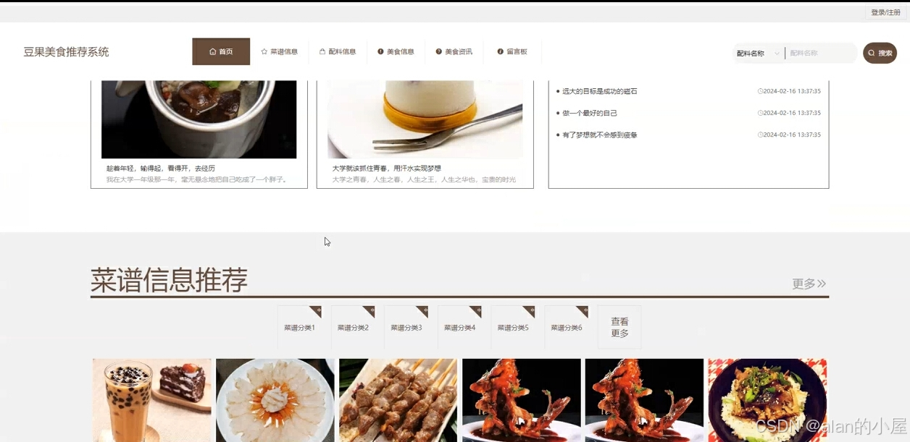
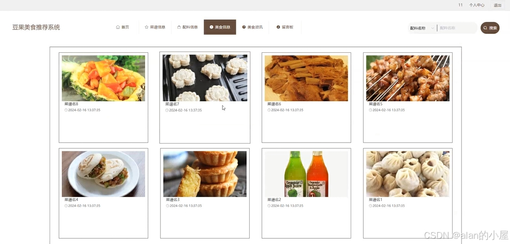
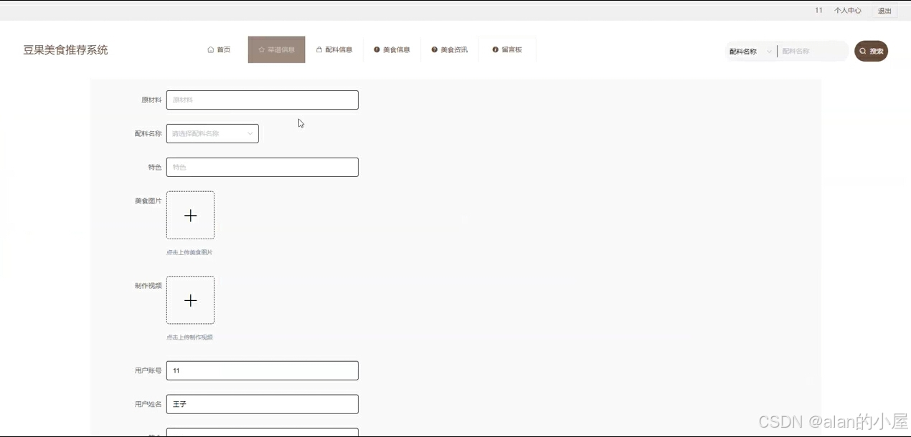
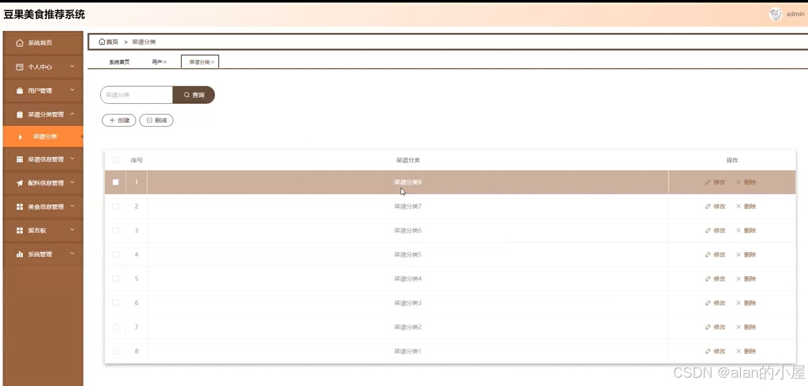
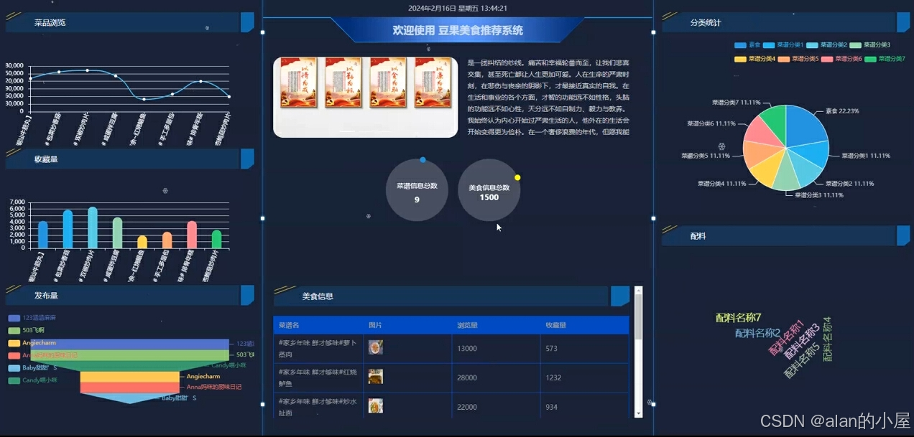

## 基于django的豆果美食推荐系统

## 介绍
👑豆果美食推荐系统是一个基于Django框架✅✅构建的美食分享平台✅✅，旨在为用户提供丰富的菜单选择与个性化推荐。用户可以方便地浏览、分享和收藏各类美食菜谱，涵盖从家常菜到各国美食的多样选择。系统通过智能算法分析用户的偏好和历史记录，推送符合用户口味的菜品，提升了用户的烹饪体验。此外，豆果美食推荐系统还鼓励用户社区互动，支持评论、评分和菜谱上传，形成良好的美食分享氛围。

## 运行环境
JAVA版本：JDK1.8 IDE类型：IDEA、Eclipse都可运行 数据库类型：MySql（8.x版本都可） 硬件环境：Windows

## 效果展示

## 源码获取 vx:  leealan289
